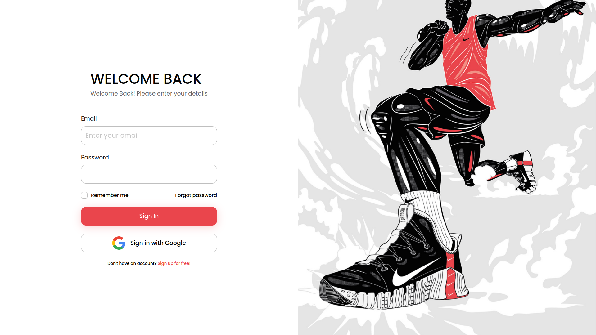

<!-- 

  

 -->
<h1 align="center">
   <a href="parkify.vercel.app"> simple-login-page-ui.vercel.app</a>
</h1>

A simple Responsive Login Page UI made while teaching Frontend Development to a friend 

  

## Tech Stack

- Vite
- TailwindCSS
- ReactJS

## Design

https://www.figma.com/file/2zlvqcNPbDyiGXOmDKR0m8/Login-Page-(Community)?node-id=0-1&t=p1UVBdcFAiF1Pvwn-0
